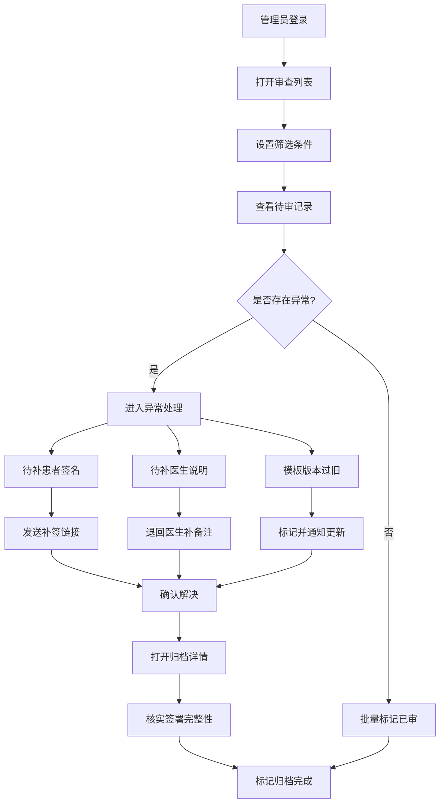

## 1. 产品概述

面向口腔诊所店长和病案管理员的电子同意书归档审查工具，确保每份电子同意书"查得全、补得上、对得准"。解决当前诊所中做了治疗却未签署同意书、签署项目与收费项目不一致、缺少医生确认等合规风险问题，为医保和卫健检查提供可追溯的归档证据链。

- 目标用户：口腔诊所店长、病案管理员
- 核心价值：降低合规风险、提升归档效率、应对检查投诉

## 2. 核心功能

### 2.1 用户角色

| 角色 | 核心权限 |
|------|----------|
| 店长 | 查看全院签署记录、处理异常、导出报表、标记归档 |
| 病案管理员 | 查看签署记录、处理异常补签、标记线下归档 |

### 2.2 功能模块

1. **审查列表页**：按日期、医生、项目、患者姓名筛选签署记录，展示待审列表，标识异常状态
2. **异常处理页**：将问题拆分为待补患者签名、待补医生说明、模板版本过旧三类，提供操作按钮
3. **归档详情页**：展示签署时间、签名图、告知内容和操作人，应对投诉和检查

### 2.3 页面详情

| 页面名称 | 模块名称 | 功能描述 |
|----------|----------|----------|
| 审查列表 | 筛选栏 | 按日期范围、医生、治疗项目、患者姓名组合筛选 |
| 审查列表 | 统计概览 | 显示今日待审数、异常数、已归档数等关键指标 |
| 审查列表 | 签署记录表 | 分页展示签署记录，每行显示患者、项目、医生、签署状态、异常标记 |
| 审查列表 | 批量操作 | 支持批量标记已审、批量导出 |
| 异常处理 | 异常分类标签 | 三个标签页：待补患者签名、待补医生说明、模板版本过旧 |
| 异常处理 | 异常列表 | 每条异常显示患者、项目、异常原因、紧急程度 |
| 异常处理 | 操作按钮 | 发送补签链接、退回医生补备注、标记线下纸质已归档 |
| 异常处理 | 状态流转 | 待处理→处理中→已解决，支持撤回操作 |
| 归档详情 | 基本信息 | 患者姓名、就诊号、治疗项目、主治医生 |
| 归档详情 | 签署信息 | 患者签署时间、医生确认时间、签名图预览 |
| 归档详情 | 告知内容 | 同意书模板版本、告知事项全文、风险提示 |
| 归档详情 | 操作记录 | 操作人、操作时间、操作类型的时间线 |

## 3. 核心流程

管理员每日关账前打开审查列表，筛选当日记录，查看是否存在以下异常：做了治疗但未签署同意书、签署项目与收费项目不一致、缺少医生确认。发现异常后进入异常处理页面，按分类处理：对缺少患者签名的发送补签链接，对缺少医生说明的退回医生补备注，对模板过旧的标记并通知更新。处理完成后在归档详情页确认签署完整性，确保所有记录合规归档。

## 4. 用户界面设计

### 4.1 设计风格

- 主色调：深靛蓝 (#1B2A4A) + 冷灰 (#F5F6FA)，辅以琥珀色 (#D4913D) 作为警示强调
- 按钮风格：圆角 6px，主按钮实心填充，次按钮描边
- 字体：思源黑体 / Noto Sans SC，标题 18px 加粗，正文 14px 常规，辅助 12px
- 布局风格：左侧固定导航栏 + 右侧内容区，表格为主的信息密集型布局
- 图标风格：线性图标，24px，与文字搭配使用

### 4.2 页面设计概览

| 页面名称 | 模块名称 | UI元素 |
|----------|----------|--------|
| 审查列表 | 筛选栏 | 日期选择器、下拉选择框、搜索输入框，浅灰背景卡片 |
| 审查列表 | 统计概览 | 4个统计卡片横排，图标+数字+标签，微动效数字跳动 |
| 审查列表 | 签署记录表 | 条纹表格，行悬浮高亮，状态标签彩色圆点，分页器 |
| 异常处理 | 分类标签 | 三个标签按钮，带数量角标，选中态下划线 |
| 异常处理 | 异常列表 | 卡片列表，左侧色条标识类型，右侧操作按钮组 |
| 异常处理 | 操作按钮 | 蓝色主按钮"发送补签链接"、灰色次按钮"退回医生"、绿色按钮"标记已归档" |
| 归档详情 | 签名图 | 白色卡片内嵌签名画布预览，带缩放按钮 |
| 归档详情 | 操作记录 | 垂直时间线，左侧时间点，右侧操作描述 |

### 4.3 响应式策略

- 桌面优先设计，最小宽度 1280px
- 侧边导航可折叠
- 表格列数较多时支持横向滚动

### 4.4 3D场景指导

不适用
