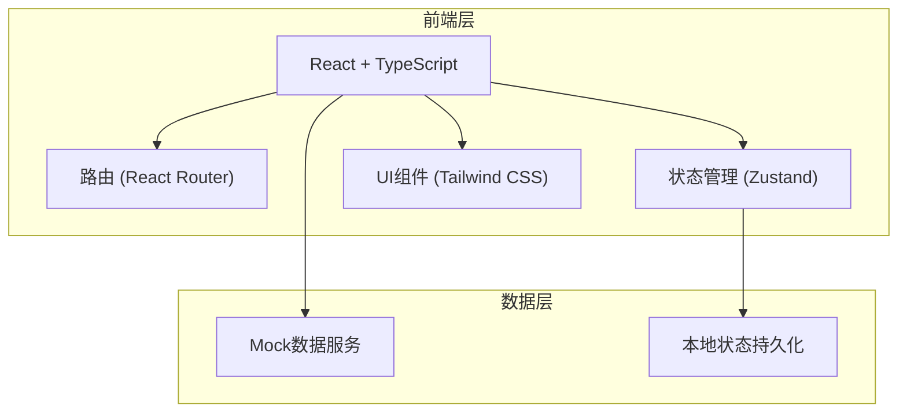
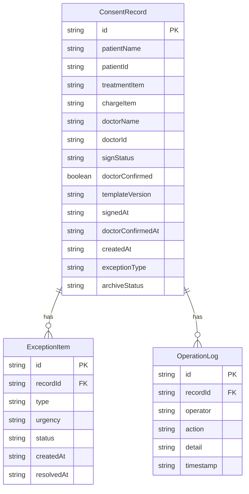

## 1. 架构设计



## 2. 技术说明

- 前端：React@18 + TypeScript + Tailwind CSS@3 + Vite
- 初始化工具：vite-init
- 后端：无（纯前端，使用模拟数据）
- 数据库：无（使用 Zustand 内存状态 + 模拟数据）

## 3. 路由定义

| 路由 | 用途 |
|------|------|
| / | 重定向到 /review |
| /review | 审查列表页，筛选和查看签署记录 |
| /exceptions | 异常处理页，分类处理异常项 |
| /detail/:id | 归档详情页，查看签署详情和操作记录 |

## 4. API定义

无后端API，所有数据通过前端模拟数据服务提供。

### 数据类型定义

```typescript
interface ConsentRecord {
  id: string
  patientName: string
  patientId: string
  treatmentItem: string
  chargeItem: string
  doctorName: string
  doctorId: string
  signStatus: 'signed' | 'unsigned' | 'partial'
  doctorConfirmed: boolean
  templateVersion: string
  signedAt: string | null
  doctorConfirmedAt: string | null
  createdAt: string
  exceptionType: ExceptionType | null
  archiveStatus: 'pending' | 'archived' | 'offline_archived'
}

type ExceptionType = 'missing_patient_signature' | 'missing_doctor_note' | 'outdated_template'

interface ExceptionItem {
  id: string
  recordId: string
  type: ExceptionType
  patientName: string
  treatmentItem: string
  doctorName: string
  urgency: 'high' | 'medium' | 'low'
  status: 'pending' | 'processing' | 'resolved'
  createdAt: string
  resolvedAt: string | null
}

interface OperationLog {
  id: string
  recordId: string
  operator: string
  operatorRole: string
  action: string
  detail: string
  timestamp: string
}

interface SignatureInfo {
  patientSignatureUrl: string | null
  doctorSignatureUrl: string | null
  informedContent: string
  templateVersion: string
  risks: string[]
}
```

## 5. 服务端架构图

不适用（纯前端项目）

## 6. 数据模型

### 6.1 数据模型定义



### 6.2 数据定义语言

使用前端 TypeScript 类型定义代替 DDL，模拟数据存储在 `src/utils/mockData.ts` 中。
